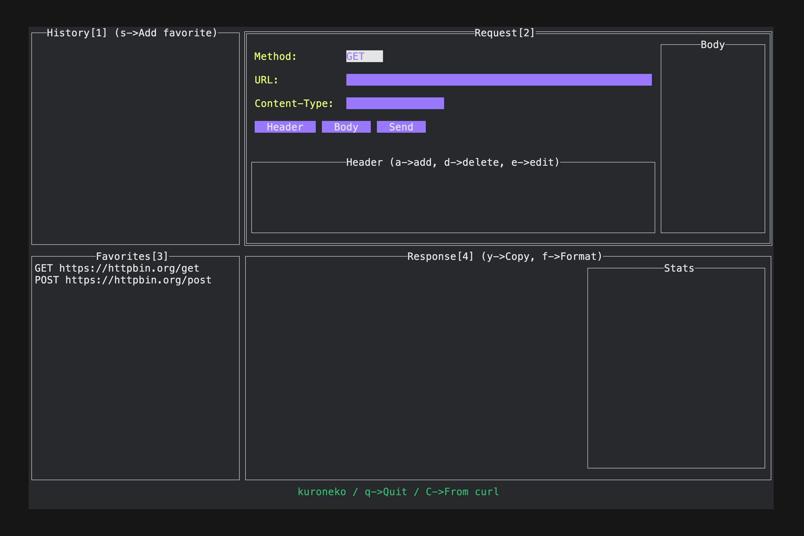

# kuroneko

A lightweight, Terminal-based HTTP API client application.

## Motivation

During web API development, using client tools like [Postman](https://www.postman.com) is common.
These tools make it easy to create and save requests, as well as inspect responses, but I found them to be too feature-rich for my needs.
So I made my own TUI application built using [rivo/tview](https://github.com/rivo/tview).

## Install

### Build from source

```shell
$ go install github.com/ikorihn/kuroneko@latest
```

## Features

### Basic Operations

Press the number keys enclosed in `[]` to switch to the corresponding pane. Once in a pane, navigate using TAB or arrow keys.

Enter `q` for Quit.

### GET Requests


The simplest way to use it is to input the URL and press Send to make a GET request.

### POST Requests



You can also send PUT, DELETE, and other requests by specifying the body.
Pressing Body button opens your favorite `$EDITOR` (defaults to `vim`) for editing the request body.

### Response


The response pane displays the response body, status code, and trace information. 
Selecting the pane opens a dialog to toggle between body, headers, and curl command display.

### History

The history pane shows the request history since launching kuroneko.
It is volatile and disappears when the process is terminated. 
Pressing `s` on a history item saves it as a favorite.

### Favorites

The favorites pane displays saved requests, persisting even after exiting the application.

### curl Command

As an experimental feature, you can convert requests to and from curl commands. While the conversion is approximate and not 100% accurate, it's a feature I personally enjoy.

Press 'C' to open a form for entering a curl command. Inputting `curl <args>` populates the request form. After sending the request, the response pane displays the converted curl command for that request.

